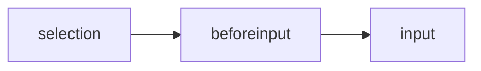

import Language from "../../components/PostHelpers/Language"

<Language path="./change-text-in-contenteditable" type="en" />

# **修改富文本编辑器的文本内容**

最近，一些用户给[PromptSnippets](https://chromewebstore.google.com/detail/promptsnippets/dkafkdphnlodjiggkpbokmponlkjfaco)插件提了一个需求，希望适配bard, claude等新兴生成式AI网站。而 PromptSnippets 当时仅支持基于 input、textarea 等简单输入框的网站，例如 chatgpt、poe。与此不同的是，bard 等网站的输入框采用了基于 contenteditable 的富文本编辑框，因此，插件无法简单地修改富文本编辑框中的文本内容。

为了适配各种网站的文本编辑框，我调研了市面上流行的网站和富文本编辑器技术方案，并找到了一种通用的文本内容管理方案，适用于主流富文本编辑器。

本文将介绍主流富文本编辑器如何管理内部文本内容状态，以及我如何通过浏览器插件来修改其状态。

## **富文本编辑器中的文本内容状态管理方案**

### 方案一：同步HTML

一种简单的文本内容状态管理方案是自动同步HTML，不依赖或不绝对依赖内部的状态管理。采用这种方案的富文本编辑器使用MutationObserver的方法监听HTML的改动，并自动同步文本内容。

这类编辑器包括 ProseMirror、Quill 等，一些网站也简单地采用了这一方案，例如 Bard。

面对这类编辑器，插件直接修改HTML内容即可。

### 方案二：自控

另一种主流的方案是自己内部维护文本内容状态，通过监听 `beforeinput` , `input` 文本输入事件来维护文本内容状态。

这类编辑器的典型特征是修改 HTML 并不会改变最终的文本内容，有些甚至可能导致编辑器崩溃。

采用这种方案的编辑器包括 Slate、Lexical 等。

对这类编辑器的文本内容进行修改较为复杂，需要模拟完整的输入事件流程：



先选择文本插入位置（点击鼠标或者脱选），然后输入文字触发beforeinput和input事件。

## 通用修改文本代码

针对上述两种编辑器类型，我总结出一种通用的修改文本的方法：先模拟输入流程，如果修改失败，再直接修改HTML。具体如下：

1. 使用MutationObserver监听DOM改动（用于后续判断模拟输入是否成功）
2. 设置选择区域包含当前所有文本内容
3. 触发beforeinput和input事件
4. 如果此时DOM没有改动就直接修改HTML

```tsx
async function setElementValue(element: ContentEditableElement, value: string) {
  let changed = false
  const clear = setElementChangeListener(element, () => {
    changed = true
  })

  // 1. simulate input event flow
  // first, select all
  const range = document.createRange()
  range.selectNodeContents(element)
  const selection = window.getSelection()
  selection.removeAllRanges()
  selection.addRange(range)
  await new Promise((resolve) => setTimeout(resolve, 20))

  // then dispatch beforeinput event
  const beforeInputEvent = new InputEvent("beforeinput", {
    bubbles: true,
    cancelable: true,
    inputType: "insertText",
    data: value,
  })
  element.dispatchEvent(beforeInputEvent)

  // then input event
  if (!beforeInputEvent.defaultPrevented) {
    const inputEvent = new InputEvent("input", {
      bubbles: true,
      cancelable: true,
      inputType: "insertText",
      data: value,
    })
    element.dispatchEvent(inputEvent)
  }
  await new Promise((resolve) => setTimeout(resolve, 20))

  // 2. if not changed, then change html directly
  if (!changed) {
    const p = document.createElement("p")
    p.textContent = value
    element.innerHTML = p.outerHTML
  }

  clear()
}
```

通过上述方法，[PromptSnippets](https://chromewebstore.google.com/detail/promptsnippets/dkafkdphnlodjiggkpbokmponlkjfaco)适配了所有富文本编辑器，几乎可以在任何网站上使用它了。
