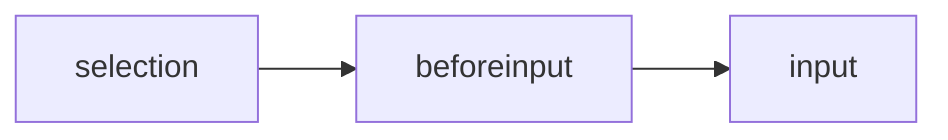

import Language from "../../components/PostHelpers/Language"

<Language path="./change-text-in-contenteditable" type="zh" />

# **Modifying the Text Content of Rich Text Editors**

Recently, some users have requested the [PromptSnippets](https://chromewebstore.google.com/detail/promptsnippets/dkafkdphnlodjiggkpbokmponlkjfaco) plugin to adapt to more generative AI websites such as bard, claude, etc. At that time, PromptSnippets only supported websites based on simple input boxes like input, textarea, etc., such as chatgpt, poe. Websites like bard use rich text editing boxes based on `contenteditable` , so the plugin cannot simply modify the text content in the rich text edit box.

In order to adapt to the text edit boxes of various websites, I have researched popular websites and rich text editor technical solutions, and found a universal text content management solution suitable for rich text editors.

This post will introduce how rich text editors manage the internal text content state, and how I modify its state through a browser plugin.

## **Text Content State Management Solutions in Rich Text Editors**

### Solution One: Synchronize HTML

A simple text content state management solution is to automatically synchronize HTML, not depending on or not absolutely dependent on internal state management. Rich text editors that adopt this solution use the MutationObserver method to monitor changes in HTML and automatically synchronize text content.

Such editors include ProseMirror, Quill, etc., and some websites have simply adopted this solution, such as Bard.

For these editors, the plugin can directly modify the HTML content.

### Solution Two: Self-Control

Another mainstream solution is to maintain the text content state internally, and maintain the text content state by listening to `beforeinput`, `input` text input events.

The typical feature of this type of editor is that modifying HTML will not change the final text content, and some may even cause the editor to crash.

Editors adopting this solution include Slate, Lexical, etc.

Modifying the text content of this type of editor is more complex, and requires simulating the complete input event process:



First select the text insertion position (click the mouse or deselect), and then enter the text to trigger the `beforeinput`  and `input`  events.

## Universal Text Modification Code

For the above two types of editor types, I have summarized a general method of modifying text: simulate the input process first, if the modification fails, modify the HTML directly.

1. Use MutationObserver to monitor DOM changes (for subsequent judgment of whether the simulated input is successful)
2. Set the selection area to include all current text content
3. Trigger beforeinput and input events
4. If the DOM does not change at this time, modify HTML directly

```tsx
async function setElementValue(element: ContentEditableElement, value: string) {
  let changed = false
  const clear = setElementChangeListener(element, () => {
    changed = true
  })

  // 1. simulate input event flow
  // first, select all
  const range = document.createRange()
  range.selectNodeContents(element)
  const selection = window.getSelection()
  selection.removeAllRanges()
  selection.addRange(range)
  await new Promise((resolve) => setTimeout(resolve, 20))

  // then dispatch beforeinput event
  const beforeInputEvent = new InputEvent("beforeinput", {
    bubbles: true,
    cancelable: true,
    inputType: "insertText",
    data: value,
  })
  element.dispatchEvent(beforeInputEvent)

  // then input event
  if (!beforeInputEvent.defaultPrevented) {
    const inputEvent = new InputEvent("input", {
      bubbles: true,
      cancelable: true,
      inputType: "insertText",
      data: value,
    })
    element.dispatchEvent(inputEvent)
  }
  await new Promise((resolve) => setTimeout(resolve, 20))

  // 2. if not changed, then change html directly
  if (!changed) {
    const p = document.createElement("p")
    p.textContent = value
    element.innerHTML = p.outerHTML
  }

  clear()
}
```

With the above method, [PromptSnippets](https://chromewebstore.google.com/detail/promptsnippets/dkafkdphnlodjiggkpbokmponlkjfaco) has adapted to all rich text editors and can be used on almost any website.